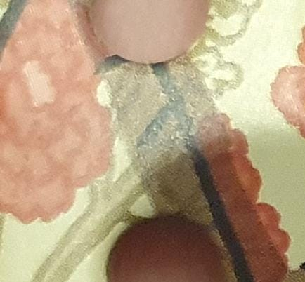
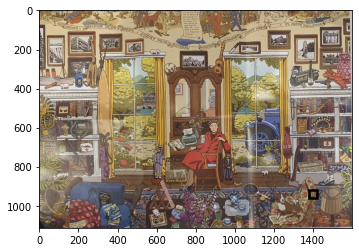
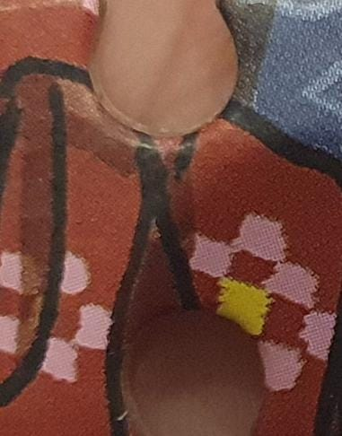

# Puzzle Solver

This is a simple puzzle solver that uses basic image processing and some basic image similarity measures to estimate the location of a puzzle piece within a puzzle.

Examples are shown below (`num_sim_to_use` and `piece_size` must be tweaked per piece in order to obtain these results - we obtained these results by tweaking post-hoc i.e. after having some rough idea of the piece location; lighting conditions and rotations were standardised):

### The puzzle:

### Example of solved piece:

  
   

### Example of solved piece:

  
   

Further improvements (please feel free to submit pull requests if you decide to expand):
- Accomodate for random streches of the puzzle piece
- Accomodate different grooves of the piece to fit adjacent pieces
- Accomodate different lighting conditions
- Accomodate rotations other than 90, 180, and 270 degrees
